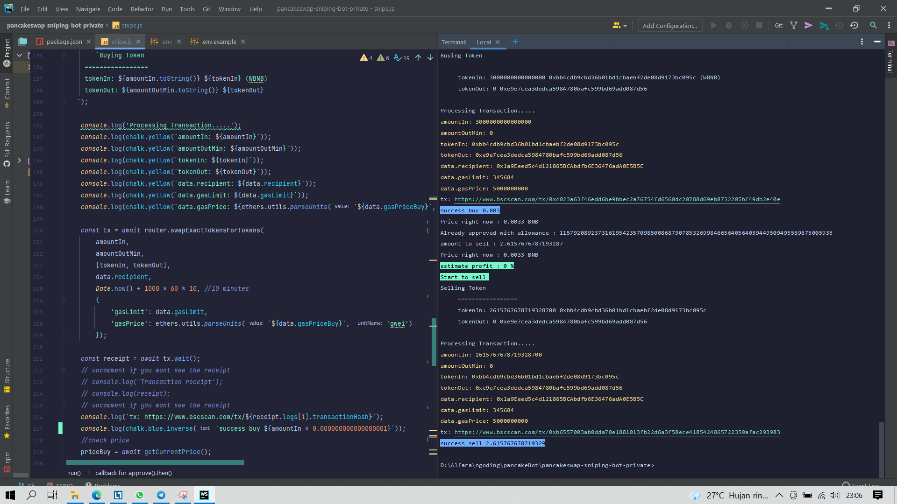
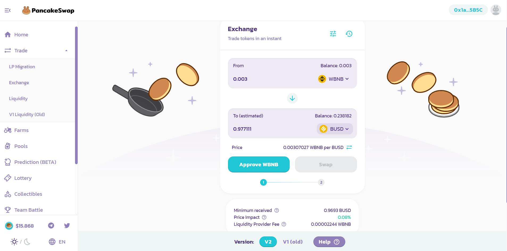
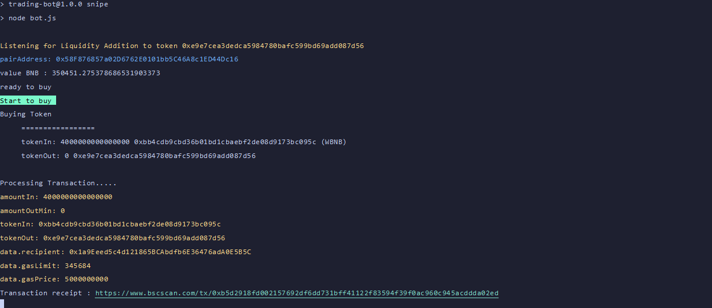

# Table of contents
* [Important Notes](#IMPORTANT-NOTES-BEFORE-RUNNING-THE-BOT)
* [Advanced Bot](#NOW-LAUNCH-ADVANCED-BOT)
* [Setup](#HOW-TO-RUN)
* [TroubleShoot](#TROUBLESHOOT)

## IMPORTANT NOTES BEFORE RUNNING THE BOT
Just edit some part of the bot, you can see the origin at : https://github.com/MrFatoni/p

### Demo for sonic advanced bot :
1. https://bit.ly/3vkSum0
2. SONIC DEGEN SCANNER : https://t.me/degenScanner
3. youtube channel : https://bit.ly/3ABcHHW
4. gitbook : https://sonic-advance-bot.gitbook.io/sonic/



### What's the feature
1. Buy early bsc gems with custom gas fee, slippage, amount.<br>
2. Auto approve token after buy. <br>
3. Sell buyed token with custom gas fee, slippage, amount. <br>
4. Sell token with your custom increasing price, like 50%, 100%, 200%.

### What's will you get
To avoid scam, I will invite you to my private repository, and you will get whole of code, and any update if I push new update. Please only contact to Discord : <code>countdown#4008</code> or <code>nafidinara@gmail.com</code> with subject <b>PancakeSwap Bot Info</b> for more info. For error or problem questions please open issues in GitHub, don't email me. Maybe I'll slow response on weekend. Thanks!

## HOW TO RUN
1. clone this repository
2. $ npm install
3. copy your <code>.env.example</code> to <code>.env</code>
4. set up your <code>.env</code> to with this explanation : 

```
WBNB_CONTRACT=0xbb4cdb9cbd36b01bd1cbaebf2de08d9173bc095c
~ WBNB contract for buy the token

FACTORY=0xcA143Ce32Fe78f1f7019d7d551a6402fC5350c73
~ Pancake Factory contract to get function of buy

ROUTER=0x10ED43C718714eb63d5aA57B78B54704E256024E
~ Pancake Factory contract to process function of buy

YOUR_ADDRESS=
~ Your BSC (BEP20) address from trustwallet or another wallet.

SLIPPAGE=1
~ Customize your slippage here, cannot decimal. (eg : 1, 5, 10). if you buy early token recommended 30+ Slippage

GWEI=5
~ Customize your GWEI (gas fee) here, cannot decimal. (eg : 5, 10, 25). if you buy early token recommended 15+ GWEI

GAS_LIMIT=345684
~ Minimul limit is 210000, more much more better.

MIN_LIQUIDITY_ADDED=3
~ Set how much minimum liquidity added in pair address that you want to buy. set in BNB. (eg : 2, 4, 7).
  2 mean 2 BNB liquidity added.

YOUR_MNEMONIC=
~ Input your private Key here, that you get from your wallet privacy.

AMOUNT_OF_WBNB=0.002
~ Amount how much you want buy the token in WBNB.

TO_PURCHASE=0xe9e7cea3dedca5984780bafc599bd69add087d56
~ Token address that you want to buy.


```
5. Approve your WBNB in pancake like this
   

6. run with <code>npm run snipe </code>.

7. Wait the bot do his job, if success, you will see like this picture. <br>
   
   
8. Close bot with <code>ctrl + C</code>.

## WARNING
All this bot feature are free, I'm never sell this bot, and I'm never share my TG account. Please be careful and DWYOR!. Only this bot is free, not advanced bot.

## TROUBLESHOOT
* there are some reason if your tx failed :
- you haven't approve your WBNB
- your gas price are to small
- your GWEI are to small (use 15+ for early token)
- your slippage are to small (use 30+ for early token)
